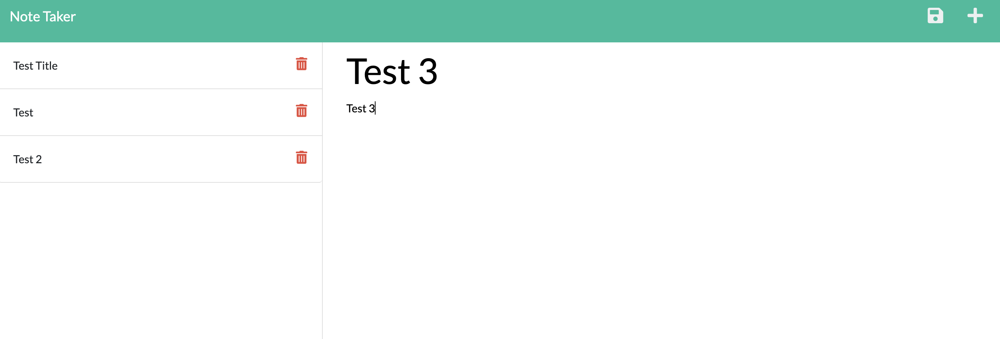
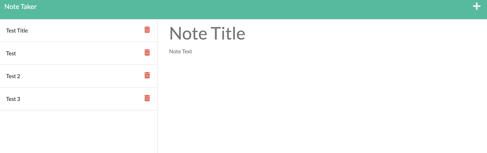

# expressjs-note-taker
Week 11 Homework Express

## Table of Contents
1. [Description](#Description)
2. [Feature](#Feature)
3. [Mockup](#Mockup)
4. [Recorded Video](#Recorded-Video)
5. [Questions](#Questions)

# Description
***
###### [Back to Table of Contents](#Table-of-Contents)
The assignment was to update existing note application to handle routing for a note taking application

## User Stories
***
###### [Back to Table of Contents](#Table-of-Contents)
```
AS A small business owner
I WANT to be able to write and save notes
SO THAT I can organize my thoughts and keep track of tasks I need to complete
```

## Acceptance Criteria
***
###### [Back to Table of Contents](#Table-of-Contents)
```
GIVEN a note-taking application
WHEN I open the Note Taker
THEN I am presented with a landing page with a link to a notes page
WHEN I click on the link to the notes page
THEN I am presented with a page with existing notes listed in the left-hand column, plus empty fields to enter a new note title and the note’s text in the right-hand column
WHEN I enter a new note title and the note’s text
THEN a Save icon appears in the navigation at the top of the page
WHEN I click on the Save icon
THEN the new note I have entered is saved and appears in the left-hand column with the other existing notes
WHEN I click on an existing note in the list in the left-hand column
THEN that note appears in the right-hand column
WHEN I click on the Write icon in the navigation at the top of the page
THEN I am presented with empty fields to enter a new note title and the note’s text in the right-hand column
```

# Mockup
***
###### [Back to Table of Contents](#Table-of-Contents)
The following images show the web application's appearance:




## Deployed Heroku Application
***
https://dry-tundra-00214.herokuapp.com/

## Credits
***
###### [Back to Table of Contents](#Table-of-Contents)
GT Bootcamp Tutors

## License
***
###### [Back to Table of Contents](#Table-of-Contents)
MIT

# Questions
***
###### [Back to Table of Contents](#Table-of-Contents)
Review my GitHub Repo: https://github.com/jae-as
Email me: janaee.as.wallace@gmail.com


